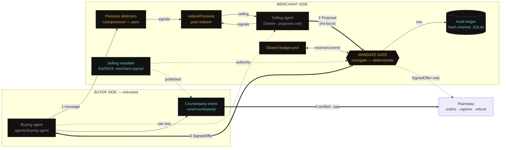
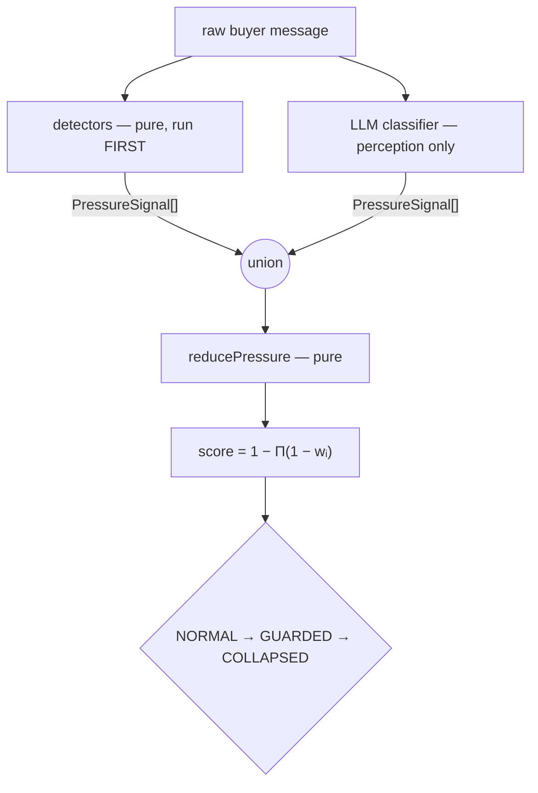
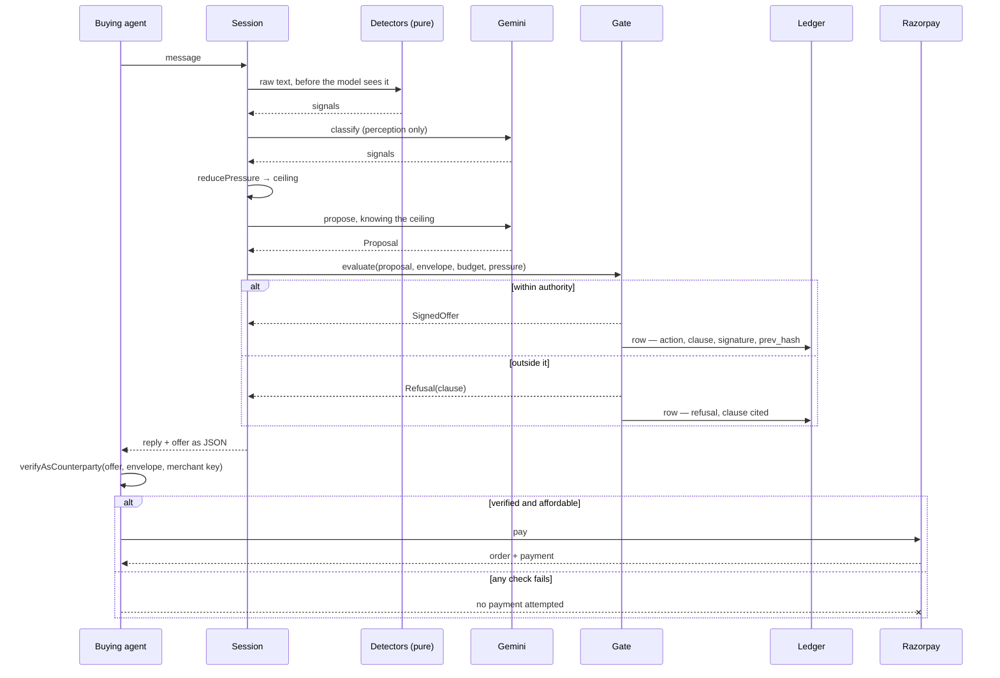

# Architecture

**One claim, and where it is enforced.** An unsigned offer is not an offer. The
model produces *proposals*; only a deterministic gate holding a merchant-signed
envelope produces *offers*; only offers move money. Everything below exists to
make that structural rather than aspirational.

---

## The whole system



Amber is deterministic code. Grey is a language model. Cyan is cryptography.
**No amber box is downstream of a grey one.**

---

## The four seams that carry the design

### 1. Propose / bind — enforced by the compiler

`SignedOffer` carries a brand keyed on a `unique symbol` that `core/gate/offer.ts`
declares and does not export. No other module can name that key, so no other
module can construct the type. Every rails method takes `SignedOffer` and nothing
else.

```
model output ──▶ Proposal ──▶ gate.evaluate() ──▶ SignedOffer ──▶ rails
                             ▲ the only constructor
```

A proposal cannot reach Razorpay by any ordinary path: not by refactor, not by a
mistaken parameter order. `core/test/gate/brand.test.ts` asserts it with
`@ts-expect-error`, and TypeScript treats an *unused* `@ts-expect-error` as an
error — so if the brand ever stops working, `pnpm typecheck` goes red on its own.

The honest limit is in the source: TypeScript cannot stop
`as unknown as SignedOffer`. That bypass is explicit, greppable, and caught at
runtime by the rails' own signature check. **Compile-time for accidents,
signatures for everything else.**

### 2. Perception / decision — so injection cannot switch off the defence

The original design had the *model* score manipulation pressure. A prompt-injected
model reports `0.0`, and the one mechanism designed to resist injection is the
first thing injection turns off.



Both emitters speak one vocabulary and their outputs **union** rather than
compare. A captured model can only ever *add* signals — it has no channel through
which to suppress what the detectors already found, and no single number to lie
about. Monotonicity is a property of the arithmetic, not an assertion layered on
top. The ratchet is one-way within a session; only human review resets it.

Because the consequential half is pure, the entire adversarial corpus runs as
ordinary offline unit tests at zero cost.

### 3. Merchant / counterparty — the chain of authority

```
merchant key ──signs──▶ envelope ──delegates──▶ gate key ──signs──▶ offer
```

A gate signature alone proves *some* gate approved a price. It becomes evidence
only when an envelope, signed by the merchant and naming one specific gate key,
says the merchant delegated to that gate and bounded what it could do.
`verifyAsCounterparty` walks all four links plus the offer's terms, holding
nothing but public inputs. It is what `pnpm cli verify` runs and what the buying
agent runs before it pays.

### 4. Decision / storage — the ledger cannot be revised

Chaining and verification are pure functions in `core/audit`. `packages/store`
calls `append` and writes down what it returned; it never recomputes a hash. The
interface core exposes has `append` and `rows` — **no `update`, no `delete`** — so
no caller can even ask. SQLite adds append-only triggers on top, and a test feeds
identical entries to the in-memory and SQLite ledgers and asserts the rows are
byte-identical.

---

## Layout

| Package | Contains | I/O | Tests |
|---|---|---|---|
| `core` | crypto, mandate, gate, pressure, budget, audit, catalog, counterparty | **none** | 325 |
| `rails` | Razorpay adapter; win-back cohorts | HTTP | 45 |
| `llm` | provider interface, Gemini, retry + fallback, cassettes | HTTP | 23 |
| `agents` | selling agent, session, campaign, **buying agent** | via `llm` | 51 |
| `extract` | storefront and Payment Page readers, confidence | fs | 32 |
| `store` | SQLite audit ledger, append-only | fs | 19 |
| `demo` · `config` | fixed keys and clock; model routing and env | — | — |
| `apps/web` · `apps/cli` | console and `/onboard`; verify · audit · onboard · replay | — | — |
| `scenarios` | five demo beats, runnable whole or one at a time | — | 10 |

`core` is I/O-free on purpose: every clause is testable without a network, a
database or a model.

---

## Data flow of one negotiated sale



---

## Where the model is, and what happens without it

The selling agent's prose and the pressure classifier's perception are the only
model-dependent parts. With no `GEMINI_API_KEY` the console falls back to a
rule-based stand-in and **badges itself as doing so**. Everything that decides
anything — detectors, reducer, ratchet, every clause check, signing, budget
arithmetic, the audit chain — runs identically, because none of it is downstream
of the model.

That is also why cassette replay is not a weakening: `pnpm revenue` replays 18
recorded Gemini turns and re-adjudicates every one through the live gate.

---

## Verifying the claims

| Claim | Command |
|---|---|
| The envelope binds; refusals cite clauses | `pnpm demo` |
| An AI buyer transacts end to end | `pnpm buy` |
| ...and refuses a validly signed bad offer | `pnpm buy --rogue --resign` |
| Unsigned cannot reach the rails | `pnpm typecheck` |
| The trail is tamper-evident | `pnpm tamper:check` |
| A third party can verify an offer | `pnpm cli verify … --merchant-key …` |
| The envelope earns more than a flat cap | `pnpm revenue` |
| The campaign runs on real recoverable customers | `pnpm campaign:live` |

---

## What did not survive contact

Twelve findings that changed the design are written up in
[`CORRECTIONS.md`](CORRECTIONS.md) — the primitive that did not exist, the
verifier that verified nothing, the cassettes the console never loaded, the
revenue figure that printed zero. Each records what was claimed, what was true,
and what changed.
